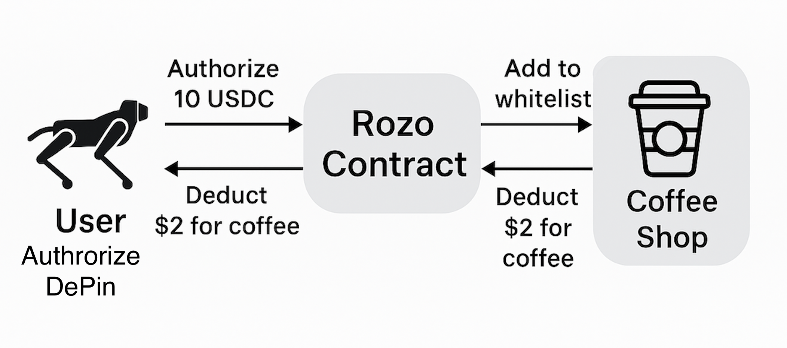

# Rozo Tap-to-Pay Smart Contract

A Solana smart contract that enables tap-to-pay functionality using tokens (like USDC).

**Deployed Contract (in progress)**: [View on Solscan (Devnet)](https://solscan.io/account/MVMxTF7pYwzi4rjKRMe8v2pKxiEcGa5TR7LbR59jiLe?cluster=devnet)

## Use Case Flow


## Real-World Payment Flow

### Coffee Purchase Example

1. **Setup**
   - Rozo deploys the smart contract on Solana
   - Rozo adds "Coffee Shop" to the merchant whitelist

2. **Customer Authorization**
   - Customer authorizes 10 USDC for Rozo payments
   - The 10 USDC remains in the customer's wallet
   - An authorization record is created on-chain

3. **Coffee Purchase**
   - Customer visits Coffee Shop and buys a $2 coffee
   - Customer taps their phone to initiate payment
   - Rozo's payment processor executes the transaction:
     - Verifies Coffee Shop is whitelisted
     - Checks customer has sufficient authorization (10 USDC)
     - Transfers 2 USDC from customer to Coffee Shop
     - Reduces customer's authorization from 10 USDC to 8 USDC

4. **Benefits**
   - Coffee Shop receives instant payment
   - Customer doesn't need to sign a transaction for each purchase
   - The remaining 8 USDC can be used for future purchases

## Technical Architecture



## How It Works

Rozo uses an escrow-like pattern without actually holding customer funds:

1. **Merchant Whitelisting**: Only approved merchants can receive payments
2. **Authorization**: Users pre-approve spending limits (not actual transfers)
3. **Processing**: A trusted payment processor executes transfers within authorization limits

## Default Token

By default, the contract uses a USDC devnet token (Gh9ZwEmdLJ8DscKNTkTqPbNwLNNBjuSzaG9Vp2KGtKJr), but it supports any SPL token.

## Key Scripts

```bash
# Add merchant to whitelist
ts-node scripts/merchant/add-merchant.ts <merchant_public_key>

# Authorize USDC for payments
ts-node scripts/authorize/authorize-usdc.ts 10

# Process a payment
ts-node scripts/payment/process-payment.ts <user_public_key> <merchant_public_key> 2
``` 